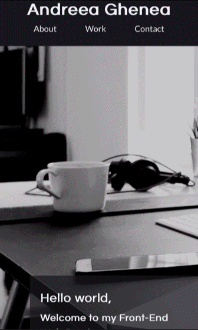

# Challenge 02 Working With CSS: Portfolio

## Description 

This web application was built as a means to show case my skills as a future front-end web developer. I was also able to better understand principles underlying responsive design, flex-box, grid as well as how to use CSS to style a page, and finally to create a place to display my current and future projects.

## Usage 

The following animations show the [web application's](https://agh911.github.io/Developer_PortfolioAG/) appearance, functionality and responsive design:

* Desktop

* Tablet

* Mobile

## Links

* [Deployed Application](https://agh911.github.io/Developer_PortfolioAG/)

## Credits

* [Hero image](https://unsplash.com/photos/m_HRfLhgABo).

## License

This project is licensed under the MIT License - see the LICENSE.md file for details.

---

© 2022 AG
